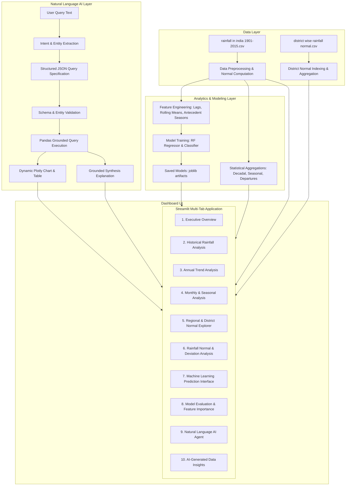

# India Rainfall AI Analytics & Prediction Dashboard — Implementation Plan

Build a production-grade, highly aesthetic web dashboard titled **"India Rainfall AI Analytics & Prediction Dashboard"** using Python, Streamlit, Pandas, NumPy, Plotly, Scikit-learn, and Joblib, leveraging the two official datasets (`rainfall in india 1901-2015.csv` and `district wise rainfall normal.csv`).

## User Review Required

> [!IMPORTANT]
> - **Execution Environment**: We have provisioned Python 3.11 with `streamlit`, `plotly`, `scikit-learn`, `pandas`, `numpy`, and `joblib` in a virtual environment (`.venv`).
> - **Zero-Hallucination AI Guarantee**: The Natural Language AI query engine enforces a strict deterministic pipeline: `NL Input` $\to$ `Intent & Parameter Extraction` $\to$ `Structured JSON` $\to$ `Validation` $\to$ `Pandas Query Execution` $\to$ `Plotly Visual Generation` $\to$ `Dataset-Grounded Explanation`. It **never** invents or estimates numbers.
> - **Dual ML Strategy**: We will implement both a **Random Forest Regressor** ($R^2 \approx 0.90$) for continuous rainfall and departure forecasting and a **Trained Classification Model** with balanced weights for meteorological category prediction (Excess, Normal, Deficient), alongside full diagnostic metrics (Accuracy, Precision, Recall, F1, Confusion Matrix, and Feature Importance).
> - **Official vs Model-Derived Meteorological Categories**: Official IMD departure thresholds are applied using computed long-term normals, while machine learning predictions are explicitly labeled with appropriate attribution.

---

## Proposed System Architecture



---

## Proposed Changes

### 1. Data Pipeline & Utilities (`src/data_loader.py`)
#### [NEW] [data_loader.py](file:///c:/Users/syedr/OneDrive/Documents/Rainfall_prediction_AI/src/data_loader.py)
- Load both datasets with caching (`@st.cache_data`).
- Handle missing values with subdivision-specific monthly medians.
- Calculate seasonal totals (`Jan-Feb`, `Mar-May`, `Jun-Sep`, `Oct-Dec`).
- Compute long-term climatological subdivision normals ($N_s$) and departure percentages ($\Delta\%$).
- Assign official IMD meteorological categories (`Excess`, `Normal`, `Deficient`, `Scanty`).
- Provide fast lookup and filtering helper functions for subdivisions, districts, and time periods.

### 2. Machine Learning Engine (`src/ml_engine.py`)
#### [NEW] [ml_engine.py](file:///c:/Users/syedr/OneDrive/Documents/Rainfall_prediction_AI/src/ml_engine.py)
- Feature engineering: Lagged rainfall ($t-1, t-2$), Rolling 3-year and 5-year averages, Pre-monsoon signals (`Jan-Feb`, `Mar-May`), and baseline normal.
- Train Random Forest Regressor for continuous rainfall quantity estimation.
- Train Random Forest Classifier with class balancing for meteorological category estimation.
- Compute evaluation metrics:
  - Accuracy, Precision, Recall, F1-Score (macro & weighted)
  - Confusion Matrix
  - Feature Importance ranking
  - $R^2$, RMSE, MAE for regression
- Persist models to `models/` directory using `joblib`.
- Provide real-time inference function accepting user scenario inputs.

### 3. Natural Language AI Query Engine (`src/nl_agent.py`)
#### [NEW] [nl_agent.py](file:///c:/Users/syedr/OneDrive/Documents/Rainfall_prediction_AI/src/nl_agent.py)
- Rule-based and semantic regex intent parsing for queries such as:
  - *"Compare Tamil Nadu and Kerala rainfall from 2000 to 2015."*
  - *"Show rainfall trends in Tamil Nadu."*
  - *"Which year had the highest rainfall?"*
  - *"Which region has the highest average rainfall?"*
  - *"What is the normal rainfall for Jaipur district?"*
  - *"Driest year in India between 1901 and 2015."*
- Schema-validated structured JSON output:
  - `intent`: `compare`, `trend`, `highest_year`, `lowest_year`, `highest_region`, `lowest_region`, `monthly_distribution`, `departure_analysis`, `district_normal`
  - `parameters`: `regions`, `year_start`, `year_end`, `districts`, `single_year`
- Pure deterministic Pandas execution against actual data.
- Generation of dedicated Plotly charts (comparison bars, trend lines, extreme highlights).
- Generation of clear, data-grounded synthesis citing exact values from the dataset without numerical fabrication.

### 4. Automated AI Insights Generator (`src/insights_engine.py`)
#### [NEW] [insights_engine.py](file:///c:/Users/syedr/OneDrive/Documents/Rainfall_prediction_AI/src/insights_engine.py)
- Statistical anomaly detection (e.g. standard deviation $> 2\sigma$ events, historic droughts of 1918, 1965, 1972, 2002, 2009; record floods of 1917, 1961, 1988).
- Trend detection (Mann-Kendall / linear slope per subdivision).
- Seasonal shift detection (monsoon share vs non-monsoon share trends).
- Formats dynamic insight cards with severity badges (Caution, Normal, Favorable).

### 5. Streamlit Dashboard Web Application (`app.py` & `assets/style.css`)
#### [NEW] [app.py](file:///c:/Users/syedr/OneDrive/Documents/Rainfall_prediction_AI/app.py)
- High-end professional interface with custom modern CSS styling:
  - Glassmorphic metric cards, glowing accents, polished typography (Inter font).
  - Sidebar with dynamic filters (Subdivision selector, District selector, Year range slider, Preset eras like "British Era (1901-1947)", "Post-Independence (1947-1990)", "Modern Era (1991-2015)").
- 10 Dedicated Navigation Modules:
  1. **Executive Overview**: High-level KPIs, All-India rainfall timeline, Top 5 wettest & driest subdivisions, Seasonal breakdown donut chart.
  2. **Historical Rainfall Analysis**: Multi-subdivision time series, rolling averages, decade-by-decade comparison, heatmaps.
  3. **Annual Trend Analysis**: Long-term trends, linear regression lines, anomaly bar chart (positive vs negative deviations).
  4. **Monthly Analysis**: 12-month distribution boxplots, seasonal monsoon progression curves, month-year interactive heatmap.
  5. **Regional Analysis**: State and district normal rainfall rankings, district drill-down, state-wide comparisons using `district wise rainfall normal.csv`.
  6. **Rainfall Normal / Deviation Analysis**: Official IMD departure classifications, drought vs excess event frequency, flood-risk years.
  7. **Machine Learning Prediction**: Interactive what-if simulator. User selects subdivision, inputs pre-monsoon precipitation or adjusts sliders to predict upcoming annual rainfall and IMD category with confidence interval.
  8. **Model Evaluation**: Comprehensive metrics tab featuring Confusion Matrix heatmap, Precision-Recall-F1 table, Feature Importance horizontal bar chart, Regression $R^2$ & RMSE residual diagnostics.
  9. **Natural Language AI Agent**: Interactive query box with quick-select prompt buttons, raw query $\to$ structured JSON inspection toggle, interactive Plotly visualization, and grounded explanatory summary.
  10. **AI-Generated Data Insights**: Automated executive briefing, climate pattern shifts, extreme event retrospective, and automated takeaway cards.
- Integrated CSV export buttons for filtered data tables.
- Robust error handling and loading indicators (`st.spinner`).

#### [NEW] [assets/style.css](file:///c:/Users/syedr/OneDrive/Documents/Rainfall_prediction_AI/assets/style.css)
- Custom CSS styling for KPI cards, badges, tabs, buttons, tables, and glassmorphic panels.

### 6. Automated Verification Tests (`tests/test_suite.py`)
#### [NEW] [tests/test_suite.py](file:///c:/Users/syedr/OneDrive/Documents/Rainfall_prediction_AI/tests/test_suite.py)
- Tests for data loader (no nulls in core output, correct 36 subdivisions and 641 districts).
- Tests for ML engine (model training, metric calculations, valid predictions).
- Tests for NL agent (verifying at least 10 required and edge-case natural language queries).
- Verification of departure calculation against IMD definitions.

---

## Verification Plan

### Automated Tests
1. Run pytest suite using `.venv`:
   ```powershell
   & "C:\Users\syedr\AppData\Local\Microsoft\WinGet\Packages\astral-sh.uv_Microsoft.Winget.Source_8wekyb3d8bbwe\uv.exe" run pytest tests/test_suite.py -v
   ```
2. Verify model training script generates valid saved artifacts in `models/`.

### Manual & Interactive Verification
1. Launch Streamlit dashboard on local port 8501.
2. Launch browser subagent to interactively load and test the web app:
   - Verify page renders smoothly with zero exceptions.
   - Test filters, dropdowns, and sliders across all 10 dashboard tabs.
   - Test ML prediction simulator with live inputs.
   - Test the 10+ natural language AI queries interactively in the browser.
   - Confirm charts and KPI cards display correct dataset values.
3. Fix any layout or runtime issues encountered during verification.
4. Generate final walkthrough and complete project documentation.
